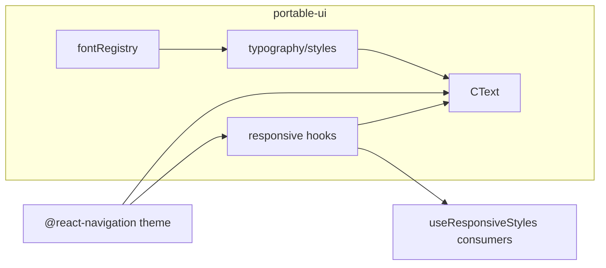

# portable-ui — модули

## typography/fontRegistry.ts

Динамический реестр имён `fontFamily` по семантическим весам.

| API | Описание |
|-----|----------|
| `configureFonts(registry)` | Мержит переданные семейства в активный реестр |
| `resetFonts(registry?)` | Сброс к `defaultFontRegistry` или переданному объекту |
| `getFontFamily(weight)` | Имя шрифта или `undefined` (системный по умолчанию) |
| `getFontRegistry()` | Текущий реестр (readonly) |
| `createFontFamilyStyle(weight)` | `{ fontFamily }` или `{}` если не настроено |

**Зачем:** в mind-jar шрифты были захардкожены как `Roboto-Regular`. Здесь host-проект задаёт семейства один раз при старте.

Типы: `FontWeightKey`, `FontRegistry`.

---

## typography/styles.ts

Базовая типографика: размеры, веса, legacy `textStyle`.

| Экспорт | Описание |
|---------|----------|
| `fontSizes` | `StyleSheet` с `size72`…`size10` (fontSize + lineHeight) |
| `getFontSizeMetrics(sizeKey)` | Числовые `fontSize` / `lineHeight` для responsive scaling |
| `getTextSizeStyle(sizeKey, weight?)` | Размер + `fontFamily` из реестра |
| `getTextWeightStyle(weight)` | Только `fontFamily` для веса |
| `textSize`, `textWeight` | Предсобранные объекты (на момент импорта модуля) |
| `textStyle` | Семантические пресеты (legacy из jar) |
| `globalStyles` | Общие утилиты |

**Размеры:** `s72` … `s10` (`TextSizeKey`).

**Веса:** `regular`, `medium`, `semiBold`, `bold`, `mono`.

> Если вызываете `configureFonts` после импорта `textSize`/`textWeight`, предпочитайте `getTextSizeStyle` / `getTextWeightStyle` в рантайме (как в `CText`).

---

## theme/navigationPalettes.ts

Справочные light/dark палитры из mind-jar для `@react-navigation/native`.

| Экспорт | Описание |
|---------|----------|
| `lightNavigationPalette` | Светлая тема с `custom.*` цветами для тегов |
| `darkNavigationPalette` | Тёмная тема |

**Когда нужны:** inline-теги `<style s14 moss>` в `CText` ищут цвет по ключу в `theme.colors`. Prawko shell-тема может не содержать `moss`, `dynamic` и т.д. — либо подключите эти палитры, либо расширьте свою тему.

Не сливается с Prawko `appTheme` в `src/theme`.

---

## hooks/useResponsiveFonts.ts

Масштабирование шрифтов относительно baseline **440×956**.

| API | Описание |
|-----|----------|
| `responsiveFont(size)` | Масштабированный размер с clamp **0.8–1.3** |
| `fontScale` | Текущий множитель |
| `isSmallDevice` / `isLargeDevice` | Пороги по ширине/высоте |

Учитывает `useWindowDimensions` и ориентацию (size-aware scaling).

---

## hooks/useResponsiveSpacing.ts

Масштабирование отступов с привязкой к сетке **4px**.

| API | Описание |
|-----|----------|
| `value(n)` | Масштабированное число, snap к 4px |
| `xs` … `xxl` | Пресеты (4, 8, 12, 16, 24, 32, 48, 64) |

Использует тот же `fontScale`, что и `useResponsiveFonts`.

---

## hooks/useResponsiveStyles.ts

Фабрика стилей с контекстом для экранов.

```ts
const styles = useResponsiveStyles(({ spacing, responsiveFont, colors }) => ({
  container: { padding: spacing.lg },
  label: { fontSize: responsiveFont(16), color: colors.text },
}));
```

| Поле контекста | Источник |
|----------------|----------|
| `spacing` | `useResponsiveSpacing()` |
| `responsiveFont` | `useResponsiveFonts()` |
| `colors` | `useTheme()` из `@react-navigation/native` |

Возвращает `StyleSheet.create(...)` результат, мемоизированный по зависимостям хуков.

---

## components/CText.tsx

Текстовый компонент с размерами, весами, выравниванием и inline-разметкой.

### Props (основные)

| Prop | Эффект |
|------|--------|
| `s72`…`s10` | Размер (взаимоисключающие; default `s16`) |
| `textStyle` | Альтернатива size-prop |
| `bold`, `medium`, `regular`, `light`, … | Вес через fontRegistry |
| `center`, `left`, `right` | `textAlign` |
| `color`, `opacity` | Переопределение цвета (default `colors.text`) |
| `responsive` | `false` отключает масштабирование |
| `ignoreStyles` | `true` (default) — strip тегов; `false` — парсинг inline |
| `dynamic` | `TextStyle` для сегментов с `dynamic` в теге |

### Inline-теги (`ignoreStyles={false}`)

- `<bold>`, `<medium>`, `<regular>`, `<italic>`, …
- `<style s14 moss dynamic opacity=0.5>текст</style>` — размер, цвет по ключу темы, флаги

Цвета сегментов: `(colors as any)[segment.color]` или строка как literal color.

### Зависимости

- `useTheme()` → `colors.text`
- `useResponsiveFonts()` → масштаб base и segment sizes

---

## index.ts

Barrel export всего публичного API. Импорт:

```ts
import { CText, configureFonts, useResponsiveStyles } from "../portable-ui";
```

---

## Диаграмма зависимостей


